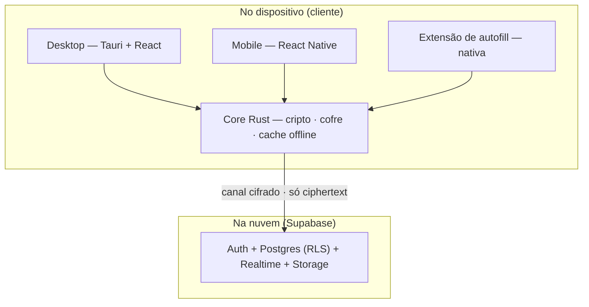

# EVEPass — Plano de Criação

Gerenciador de senhas multiplataforma, **zero-knowledge**, para uso pessoal e de time. Referências de produto: NordPass e Bitwarden (corrigindo a organização visual sofrível do Bitwarden). Referências de acabamento: Linear, Raycast, Vercel, Notion.

---

## 1. Objetivo e princípios

EVEPass é uma ferramenta privada para você e seu time guardarem credenciais com segurança de ponta e uma experiência de uso que não irrita. Não é um SaaS para vender — então não há foco em monetização, planos ou compliance formal. Ainda assim, por ser um cofre de senhas, a barra de segurança é a mais alta possível.

Princípios que guiam todas as decisões abaixo:

- **Zero-knowledge de verdade.** O servidor nunca vê senha nem conteúdo — só blobs cifrados. A criptografia acontece 100% no cliente.
- **UX premium, teclado em primeiro lugar.** Organização visual clara (o oposto do Bitwarden), cópia granular, command palette com atalho global.
- **Cripto de ponta com agilidade.** Primitives modernas hoje, e uma camada versionada que permite trocar/adicionar algoritmos (incl. pós-quântico) depois sem reescrever.
- **Offline-first.** Cache local cifrado; o app funciona sem rede e sincroniza quando volta.
- **Custo perto de zero.** Backend no free tier do Supabase, migrável para self-host se um dia crescer.

---

## 2. Decisões travadas (resumo)

| Dimensão | Escolha | Porquê |
|---|---|---|
| Modelo de sync | Nuvem zero-knowledge | Sync entre dispositivos + base para sharing; servidor só guarda ciphertext |
| Stack de cliente | Núcleo Rust + UIs web | Uma cripto auditável em todas as plataformas |
| Desktop | Tauri v2 + React | Binários leves, tray/menu bar nativos, sandbox seguro, seu React |
| Mobile | React Native + core Rust | Framework mobile maduro, ainda React, compartilha o core via UniFFI |
| Acesso rápido | Command palette (estilo Raycast) | Atalho global, busca + cópia por teclado sem abrir o app |
| Criptografia | Baseline forte | Argon2id + XChaCha20-Poly1305 + X25519/Ed25519 + HPKE + agilidade |
| Organização | Híbrido (pastas + tags + smart views) | Estrutura espacial + flexibilidade + segurança como navegação |
| Backend | Supabase (managed, free tier) | Postgres + auth + realtime prontos, open-source, sem lock-in |
| Objetivo | Uso pessoal / time | Sem GTM/compliance; sharing como collections simples |

---

## 3. Arquitetura



**Princípio central de separação:** o core Rust é **puro** — faz criptografia, gerencia o cofre e mantém o cache local cifrado, mas **não fala com a rede**. A camada de shell (React no desktop e no mobile) usa o cliente JS do Supabase para I/O e Realtime, passando apenas ciphertext de/para o core. Isso mantém o core testável, agnóstico de backend e reutilizável — inclusive pela extensão nativa de autofill, que linka o core e lê o cache local (sem precisar de rede).

**Componentes:**

- **Core Rust** — KDF, cifragem, derivação de chaves, gerador de senhas, TOTP, busca fuzzy, versionamento de itens. Exposto às UIs e às extensões via **UniFFI** (gera bindings Swift, Kotlin e JS/TS de uma única base).
- **Desktop (Tauri v2 + React)** — janela principal (o mockup já feito), command palette com atalho global e ícone de tray/menu bar.
- **Mobile (React Native)** — cofre + biometria, consumindo o core via UniFFI.
- **Extensão de autofill (nativa)** — iOS AutoFill Credential Provider e Android Autofill/Credential Manager. Rodam **fora** do processo do app (por isso são Swift/Kotlin), linkam o core e leem o cache local.
- **Backend (Supabase)** — Auth (sessão/JWT), Postgres com Row Level Security (armazena os blobs), Realtime (push de mudanças) e Storage (anexos cifrados).

---

## 4. Modelo criptográfico

### Primitives (baseline forte)

- **KDF:** Argon2id — ponto de partida `m = 256 MiB, t = 3, p = 4`, tunado para ~0,7 s no dispositivo mais fraco. Resiste a brute-force em GPU/ASIC.
- **Derivação/separação de domínio:** HKDF-SHA-256.
- **Cifra do cofre (em repouso):** XChaCha20-Poly1305 (AEAD, nonce de 192 bits — sem a fragilidade de reuso de nonce do AES-GCM).
- **Troca de chave / sharing:** X25519 + HPKE (RFC 9180).
- **Assinaturas:** Ed25519.
- **Aleatoriedade:** CSPRNG do SO (getrandom). Segredos são zerados da memória (zeroize) após uso.

### Hierarquia de chaves

```
senha-mestra ──Argon2id(userSalt)──▶ masterKey
                                        ├─HKDF("eve/enc")─▶ encKey   (fica no device)
                                        └─HKDF("eve/auth")─▶ authKey  (vai ao Supabase)

vaultKey (256 bits, aleatória)  ──cifra──▶ todos os itens
wrapped_vault_key = AEAD(encKey, vaultKey)                (guardado no servidor)
par X25519 + Ed25519 (para sharing) → privadas = AEAD(vaultKey, ...)  (no servidor)
```

Uma única passada cara de Argon2id; o resto é HKDF barato. Trocar a senha só re-embrulha a `vaultKey` (rápido) e atualiza o `authKey` — os itens **não** são re-cifrados.

### Fluxo de login zero-knowledge no Supabase

1. **Signup:** gerar `userSalt` e params; derivar `masterKey → encKey, authKey`; gerar `vaultKey` e o par de chaves; registrar no Supabase Auth com `email + authKey` (o `authKey` faz o papel de "senha"); gravar `profiles` (salt, params, `wrapped_vault_key`, chaves públicas, privadas embrulhadas).
2. **Login:** derivar de novo; `supabase.auth.signInWithPassword(email, authKey)` → JWT; baixar `profiles` + `items`; desembrulhar `vaultKey` com `encKey`; decifrar tudo com `vaultKey`.
3. **Resultado:** o Supabase te autentica mas **é incapaz de decifrar** — ele só recebeu o `authKey`, nunca a `encKey` nem a `vaultKey`.

### Recuperação (crítico — não há Secret Key)

Como o modelo é zero-knowledge e sem Secret Key, **esquecer a senha-mestra = perda de dados**. Mitigação obrigatória no onboarding: gerar um **Recovery Code** de alta entropia (128 bits), exibido uma única vez como "kit de emergência" para guardar offline, e gravar `wrapped_vault_key_recovery = AEAD(recoveryKey, vaultKey)`. Quem esquece a senha usa o Recovery Code para recuperar a `vaultKey` e definir nova senha. (Para o time, recuperação assistida por admin pode ser opcional por collection — quebra o ZK puro só daqueles itens, então fica opt-in explícito.)

### Cripto-agilidade

Todo blob começa com um header `{ alg_version }`. Adicionar pós-quântico híbrido (X25519 + ML-KEM-768 no HPKE), trocar a cifra, ou ligar o Secret Key = incrementar a versão + rota de reencriptação lazy. Sem esta camada desde o dia zero, migrar depois dói — por isso ela entra na Fase 0.

---

## 5. Modelo de dados

**Regra de ouro do ZK:** os dados de organização (pertencimento a pastas, tags) vivem **dentro** do blob cifrado de cada item. O servidor guarda só linhas opacas; o cliente decifra tudo e reconstrói árvore/tags/smart-views em memória (o cofre é pequeno o suficiente para carregar inteiro). Pastas e collections também existem como linhas cifradas para permitir pastas vazias e compartilhamento.

```sql
-- Chaves por usuário
create table profiles (
  user_id uuid primary key references auth.users(id) on delete cascade,
  kdf_salt bytea not null,
  kdf_params jsonb not null,             -- {alg:"argon2id", m, t, p}
  wrapped_vault_key bytea not null,      -- vaultKey cifrada com encKey
  wrapped_vault_key_recovery bytea,      -- vaultKey cifrada com o Recovery Code
  public_key bytea not null,             -- X25519 (sharing)
  signing_public_key bytea not null,     -- Ed25519
  wrapped_private_keys bytea not null,   -- privadas, cifradas com vaultKey
  created_at timestamptz default now()
);

-- Itens (blob AEAD: {tipo, título, usuário, senha, notas, totp, url, pastas[], tags[]})
create table items (
  id uuid primary key default gen_random_uuid(),
  user_id uuid not null references auth.users(id) on delete cascade,
  collection_id uuid references collections(id),  -- opcional (item de time)
  ciphertext bytea not null,
  nonce bytea not null,
  revision bigint not null default 1,             -- para sync/conflito
  updated_at timestamptz default now(),
  deleted_at timestamptz                          -- soft delete p/ sync
);

-- Pastas cifradas ({nome, parent_id})
create table folders (
  id uuid primary key default gen_random_uuid(),
  user_id uuid not null references auth.users(id) on delete cascade,
  ciphertext bytea not null,
  nonce bytea not null,
  revision bigint not null default 1,
  updated_at timestamptz default now(),
  deleted_at timestamptz
);

-- Compartilhamento p/ time
create table collections (
  id uuid primary key default gen_random_uuid(),
  owner_id uuid not null references auth.users(id),
  ciphertext bytea not null,             -- {nome}
  nonce bytea not null,
  created_at timestamptz default now()
);
create table collection_members (
  collection_id uuid references collections(id) on delete cascade,
  user_id uuid references auth.users(id) on delete cascade,
  wrapped_collection_key bytea not null, -- collectionKey cifrada p/ a public_key do membro (HPKE)
  role text not null default 'member',   -- 'admin' | 'member'
  primary key (collection_id, user_id)
);
```

**Row Level Security** (o que garante o isolamento no servidor):

```sql
alter table items enable row level security;
create policy items_owner on items for all
  using (auth.uid() = user_id) with check (auth.uid() = user_id);
create policy items_shared_read on items for select
  using (collection_id in (
    select collection_id from collection_members where user_id = auth.uid()
  ));
```

**Realtime:** cada dispositivo assina as próprias linhas — `postgres_changes` na tabela `items` com filtro `user_id=eq.<uid>` — e recebe mudanças quase na hora.

**Smart views** (senhas fracas, reutilizadas, sem 2FA, vazadas, compartilhados) são **computadas no cliente** sobre os itens decifrados. "Vazadas" usa a API Pwned Passwords do HIBP com **k-anonymity** (envia só os 5 primeiros caracteres do hash SHA-1 e compara localmente) — privado e grátis.

---

## 6. UX e organização

O paradigma híbrido já está desenhado no mockup: sidebar com **Todos os itens → Visões inteligentes → Pastas aninhadas → Tags**, lista com cópia rápida por linha, e item aberto com cópia por campo (usuário, senha, TOTP, URL). Diferenças-chave frente ao Bitwarden:

- Um item pode viver em **várias pastas** e ter tags (não fica preso a uma pasta só).
- Segurança vira **navegação** (smart views), não relatório escondido.
- **Command palette** (atalho global) para achar e copiar por teclado sem abrir a janela.
- **Autofill** no mobile via extensão nativa; **cópia granular** em todo lugar; **gerador de senhas** e **TOTP** embutidos.

---

## 7. Sync, offline e conflitos

- **Cache local cifrado** (SQLite via SQLCipher, ou arquivo gerido pelo core) — o app abre e opera offline; a extensão de autofill lê desse cache.
- **Versionamento por item** (`revision`) + **last-write-wins**. Em divergência real (edição offline nos dois lados), gera uma **cópia de conflito** em vez de perder dados silenciosamente.
- **Realtime** do Supabase empurra mudanças; sem polling. CRDT foi descartado por ser overkill e brigar com blobs cifrados — dá pra evoluir depois se o uso ficar muito offline-heavy.

---

## 8. Segurança e modelo de ameaças

- **O que o servidor vê:** e-mails, tamanhos de blobs, timestamps, o grafo de pertencimento a collections. **Nunca:** senhas, conteúdo, nomes de pastas/tags/itens.
- **Auto-lock** por inatividade e ao suspender; **limpar clipboard** automaticamente após copiar (ex.: 30 s).
- **Biometria** (Face ID / Touch ID / biometria Android) para destravar rápido, com a chave protegida pelo enclave seguro do dispositivo.
- **Breach monitoring** via HIBP k-anonymity (senhas vazadas) e detecção local de senhas fracas/reutilizadas.
- **Recuperação** por Recovery Code / kit de emergência (ver §4). Sem isso, esquecer a senha = perda total.
- **Sem Secret Key agora**, mas a camada de agilidade deixa adicioná-lo (e o pós-quântico) depois sem reescrever.

---

## 9. Roadmap em fases

> **Progresso (2026-07-06):** Fases 0, 1, 2, 4 ✅ e Fase 5 🟡 parcial implementadas/compilando; Fase 3 🟡 parcial (core mobile compila iOS/Android). **57 testes no core** (incl. pós-quântico híbrido, Secret Key 2SKD, passkeys ES256). Validação runtime pendente. Detalhes em [`STATUS.md`](./STATUS.md).

- **✅ Fase 0 — Fundação cripto.** Core Rust com KDF/AEAD/keypairs/HKDF + testes de vetor conhecidos; bindings UniFFI; provisionar Supabase + esquema + RLS; fluxo de signup/login ZK ponta a ponta validado por uma CLI de teste (sem UI). Estabelecer a camada de cripto-agilidade aqui. *(código pronto; validação ZK contra Supabase real pendente)*
- **✅ Fase 1 — MVP desktop.** Tauri + React; destravar; CRUD de itens; pastas/tags; busca; cópia por campo; cache local cifrado; sync via Realtime; gerador de senhas. *(implementado; validação GUI pendente)*
- **✅ Fase 2 — Experiência premium.** Command palette + atalho global + tray; smart views (fracas/reutilizadas/sem 2FA/vazadas via HIBP); TOTP; auto-lock + limpar clipboard; import do Bitwarden/NordPass/CSV. *(implementado; validação GUI pendente)*
- **🟡 Fase 3 — Mobile.** App React Native (destravar + biometria + cofre + cópia); extensão de autofill nativa (iOS Credential Provider, Android Autofill/Credential Manager) linkando o core. *(core mobile pronto: match_credentials eTLD+1 + caminho biométrico testados; xcframework iOS e .so Android gerados via UniFFI. App RN + extensões nativas em scaffold — build/run completo precisa de projeto Xcode/Gradle + device.)*
- **✅ Fase 4 — Time.** Collections + convites + compartilhamento via HPKE; breach monitoring (HIBP); recovery/kit de emergência polido. *(core HPKE testado — share E2E, assinatura do sharer, rotação; SQL/RLS + UI desktop compilando; validação entre 2 contas reais pendente.)*
- **🟡 Fase 5 — Opcionais.** Autofill de desktop + extensão de navegador; pós-quântico híbrido (X25519 + ML-KEM-768 pela camada de agilidade); Secret Key opcional; passkeys. *(5B pós-quântico, 5C Secret Key e 5D passkeys implementados e testados no core; 5A extensão MV3 em scaffold. Integração viva no fluxo de conta/UI + host da extensão pendentes.)*

---

## 10. Stack e bibliotecas

- **Core (Rust):** `argon2`, `hkdf`, `sha2`, `chacha20poly1305` (XChaCha20-Poly1305), `x25519-dalek`, `ed25519-dalek`, `hpke`, `rand`/`getrandom`, `zeroize`, `totp-rs`, `uniffi`; cache local com `rusqlite` + SQLCipher (ou `libsql`).
- **Desktop:** Tauri v2, React + Vite, TanStack Router/Query, Tailwind (sistema de design do mockup).
- **Mobile:** React Native (Expo ou bare), mesma linguagem visual; `@supabase/supabase-js`; módulos nativos para autofill + biometria.
- **Backend:** Supabase — Auth, Postgres + RLS, Realtime, Storage (free tier). Migração futura para self-host (é só Postgres + auth) sem tocar no cliente.

---

## 11. Riscos e mitigações

- **Autofill mobile é a parte mais chata** (extensões nativas de SO) e a mais usada — reservar tempo real na Fase 3.
- **Recuperação sem Secret Key é crítica** — o kit de emergência é obrigatório no onboarding, senão risco de perda de dados.
- **Escopo solo** — fasear é essencial; ter o MVP desktop usável antes de partir pro mobile.
- **Cripto-agilidade desde a Fase 0** — adicionar depois é caro.
- **Free tier do Supabase** pausa com inatividade e tem limites — ok para pessoal/time; monitorar e migrar para self-host se crescer.

---

## 12. Próximos passos imediatos

1. Criar o monorepo: `core/` (Rust), `apps/desktop` (Tauri), `apps/mobile` (RN), `infra/` (SQL do Supabase).
2. Escrever o core mínimo (Argon2id + XChaCha20-Poly1305 + keypairs + HKDF) com testes de vetor.
3. Provisionar o Supabase, aplicar esquema + RLS, e validar o login ZK ponta a ponta pela CLI.
4. Quebrar este plano em um PRD por fase para rodar no Claude Code.
