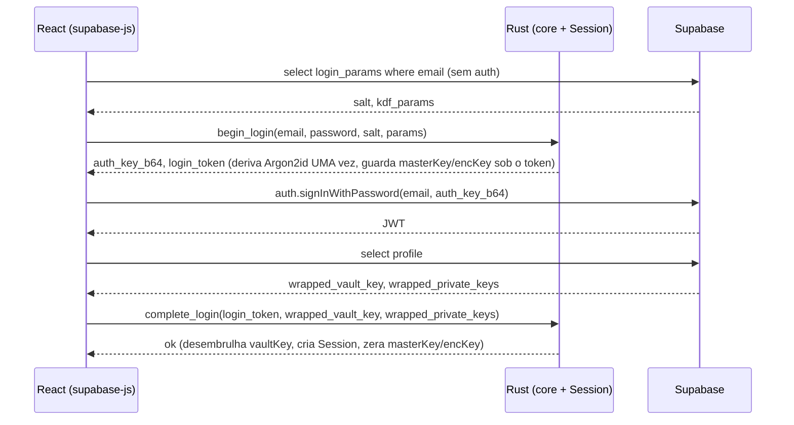

# PRD — EVEPass · Fase 1: MVP desktop (Tauri + React)

> **Status (2026-07-06): ✅ implementado e compilando** em `apps/desktop/` (backend Tauri v2 + frontend React/Vite/Tailwind). Todos os comandos do §6, cache local cifrado, sync Realtime com cópia de conflito e `copy_field` no Rust. Frontend (`tsc+vite`) e backend (`cargo`) sem warnings. 🟡 Pendente a validação runtime da GUI contra Supabase real. Progresso em [`STATUS.md`](./STATUS.md).

> Segundo PRD da série. Constrói o primeiro app real sobre o core da Fase 0. Consumir com Claude Code.

## 1. Objetivo

Um app de desktop utilizável no dia a dia: destravar, criar/editar/organizar/copiar credenciais, com **cache local cifrado** (funciona offline) e **sync** entre dispositivos via Supabase Realtime. A UI segue o mockup já aprovado (sidebar híbrida + lista + detalhe). Ao fim da fase, você usa o EVEPass de verdade no seu Mac/PC.

## 2. Pré-requisitos e refinamento herdado da Fase 0

Depende do `evepass-core` e do esquema Supabase da Fase 0.

**Refinamento a incluir (idealmente já na Fase 0):** para derivar o `authKey` *antes* de autenticar (senão vira problema de ovo-e-galinha: você precisa do salt, que está num profile protegido por RLS), adicione uma tabela pública lida **sem auth**:

```sql
create table login_params (
  email text primary key,
  kdf_salt bytea not null,
  kdf_params jsonb not null
);
alter table login_params enable row level security;
create policy login_params_read on login_params for select using (true); -- leitura anônima por email
```

Populada no signup. Trade-off aceito para uso pessoal/time: permite enumeração de e-mails cadastrados — irrelevante nessa escala, e é o mesmo padrão do Bitwarden (prelogin).

## 3. Escopo

**Dentro:**
- Shell Tauri v2 (backend Rust consome o `evepass-core` **direto** como dependência) + frontend React (Vite + TanStack Router/Query + Tailwind).
- Onboarding (criar conta) e unlock.
- CRUD de itens (login, nota segura, cartão — comece por login).
- Pastas aninhadas + tags; atribuição de itens.
- Busca fuzzy client-side.
- Cópia por campo.
- Gerador de senhas (UI sobre o core).
- Cache local cifrado + fila de upload offline.
- Sync via Supabase Realtime com reconciliação (LWW + cópia de conflito).
- Botão "Travar" manual + travar ao fechar.

**Fora (Fase 2):** command palette + atalho global + tray; smart views; código TOTP ao vivo + contador (na Fase 1 o segredo TOTP é só um campo salvo); auto-lock por inatividade; limpar clipboard com timer; import de Bitwarden/NordPass/CSV; SQLCipher (defesa extra no cache).

## 4. Arquitetura da fase (a fronteira Rust ↔ React)

Regra inviolável: **a `vaultKey` e qualquer material de chave vivem só no backend Rust** (dentro de uma `Session` em memória, zerada no drop). O plaintext de um item cruza a fronteira **apenas para exibição/edição**; chaves, **nunca**. O I/O do Supabase (auth, REST, Realtime) é feito no **JS** com `@supabase/supabase-js`; a criptografia, o cache local e a `Session` ficam no **Rust**, expostos via comandos Tauri.

```
React (supabase-js)  ──ciphertext (envelopes) + plaintext p/ exibir──▶  Tauri commands (Rust: core + cache + Session)
      │  auth, REST, Realtime                                                   │  cripto, cache local, vaultKey
      ▼                                                                          ▼
   Supabase  ◀───────────────── só ciphertext ─────────────────────────────  (nunca vê chave nem plaintext)
```

Por que o backend Rust usa o core direto (e não UniFFI): no Tauri o backend **já é Rust**, então basta declarar `evepass-core` como dependência e expor `#[tauri::command]`. UniFFI fica reservado pro mobile (Fase 3).

## 5. Fluxos de autenticação

### Signup
1. JS → Rust: `create_account(email, password)` → `NewAccount` (salt, params, `auth_key_b64`, wrapped keys, chaves públicas, `recovery_code`).
2. JS → Supabase: `auth.signUp({ email, password: auth_key_b64 })`.
3. JS → Supabase (autenticado): `insert` em `login_params` (salt, params) e `profiles` (wrapped keys + públicas).
4. JS mostra o **recovery code uma única vez** (kit de emergência).

### Login (resolve o prelogin)



`begin_login` + `complete_login` evoluem o contrato da Fase 0 para **não** rodar Argon2id duas vezes no login.

## 6. Contrato dos comandos Tauri

```rust
// Estado
fn vault_status() -> String;                         // "locked" | "unlocked"

// Auth (só cripto; o I/O do Supabase é no JS)
fn create_account(email: String, password: String) -> NewAccount;
struct BeginLogin { auth_key_b64: String, login_token: String }
fn begin_login(email: String, password: String, salt: Vec<u8>, params: KdfParams) -> BeginLogin;
fn complete_login(login_token: String, wrapped_vault_key: Vec<u8>,
                  wrapped_private_keys: Vec<u8>) -> Result<()>;
fn lock();

// Itens (operam no cache local; devolvem plaintext só p/ exibição)
struct ItemView { id: String, type_: String, title: String, username: String,
                  url: String, has_totp: bool, folders: Vec<String>, tags: Vec<String>,
                  revision: i64, updated_at: String }
fn list_items() -> Vec<ItemView>;
fn get_item(id: String) -> Result<String>;           // JSON completo decifrado (§4.4 da Fase 0)
struct Saved { id: String, envelope_b64: String, revision: i64, deleted: bool }
fn save_item(id: Option<String>, item_json: String) -> Result<Saved>;  // grava no cache (dirty) e devolve o envelope p/ o JS subir
fn delete_item(id: String) -> Result<Saved>;         // soft delete
fn mark_synced(kind: String, id: String, revision: i64);  // JS confirma upload → limpa dirty
fn copy_field(id: String, field: String) -> Result<()>;   // Rust decifra e escreve no clipboard (valor NÃO vai ao JS)

// Pastas
struct FolderView { id: String, name: String, parent_id: Option<String>, revision: i64 }
fn list_folders() -> Vec<FolderView>;
fn save_folder(id: Option<String>, name: String, parent_id: Option<String>) -> Result<Saved>;
fn delete_folder(id: String) -> Result<Saved>;

// Sync
struct RemoteRow { kind: String, id: String, envelope_b64: String, revision: i64,
                   updated_at: String, deleted: bool }
struct SyncResult { updated: Vec<String>, conflicts: Vec<String> }
fn apply_remote_changes(rows: Vec<RemoteRow>) -> Result<SyncResult>; // decifra, reconcilia, atualiza cache
struct PendingRow { kind: String, id: String, envelope_b64: String, revision: i64, deleted: bool }
fn pending_uploads() -> Vec<PendingRow>;             // o que está dirty, p/ o JS subir na reconexão

// Utilitário
fn generate_password(opts: GenOptions) -> String;
```

## 7. Cache local + fila de upload

SQLite gerido pelo backend Rust. Guarda **envelopes** (que já são ciphertext AEAD ligado à `vaultKey`), então o conteúdo está protegido em repouso mesmo sem SQLCipher (esse fica como defesa extra na Fase 2).

```sql
create table cache_items (
  id text primary key,
  envelope blob not null,
  revision integer not null,
  updated_at text,
  deleted integer default 0,
  dirty integer default 0      -- pendente de upload
);
create table cache_folders (   -- mesma forma
  id text primary key, envelope blob not null, revision integer not null,
  updated_at text, deleted integer default 0, dirty integer default 0
);
create table meta (key text primary key, value text);  -- ex.: cursor de last_sync
```

Edição offline: `save_item`/`save_folder` gravam com `dirty = 1`. Quando há rede, o JS lê `pending_uploads()`, sobe via supabase-js e chama `mark_synced` a cada sucesso.

## 8. Sync via Realtime + reconciliação

- **Warm-up:** ao destravar, o JS faz `select *` de `items` e `folders` e chama `apply_remote_changes(todos)`.
- **Ao vivo:** o JS assina `postgres_changes` (tabelas `items` e `folders`, filtro `user_id=eq.<uid>`); cada mudança vira `apply_remote_changes([row])`.
- **Regras de reconciliação** (no Rust, por linha remota):
  - Não existe local → inserir.
  - Existe e **não** está dirty → **last-write-wins** por `revision` (desempate por `updated_at`); atualizar o cache.
  - Existe, está dirty **e** a `revision` remota avançou além da base → **conflito**: o remoto vira canônico e cria-se um novo item local `"<título> (conflito)"` com o conteúdo dirty (novo id, `dirty = 1` para subir). Sem perda silenciosa.
  - `deleted = 1` propaga como soft delete.
- Toda escrita local incrementa `revision`.

## 9. Requisitos de UI

### 9.1 Onboarding / Unlock
- Tela de criar conta (email + senha-mestra + confirmação; medidor de força) → mostra o **recovery code** uma vez, exige confirmação de que foi guardado.
- Tela de unlock (email + senha). Erro de senha = mensagem clara (falha de AEAD, sem travar o app).

### 9.2 Janela principal (segue o mockup)
- **Sidebar:** "Todos os itens" · seção Pastas (árvore aninhada, expandir/colapsar) · seção Tags. (As smart views ficam como seção presente porém desabilitada/placeholder até a Fase 2.)
- **Lista:** itens da seleção, com monograma, título, usuário e cópia rápida por linha.
- **Detalhe:** item aberto com campos e **cópia por campo** (usuário, senha com mostrar/ocultar, URL, e o campo TOTP salvo — sem código ao vivo ainda).

### 9.3 CRUD de itens
- Formulário de criar/editar (tipo, título, usuário, senha, URL, notas, TOTP, campos customizados, pastas, tags).
- Botão de gerar senha dentro do form (abre o gerador).
- Excluir (soft delete) com confirmação.

### 9.4 Pastas e tags
- Criar/renomear/excluir pastas; aninhar (definir `parent_id`).
- Atribuir item a uma ou mais pastas e a tags (via o form de edição). *Drag-and-drop entre pastas é desejável; se apertar o tempo, vai pra polimento da Fase 2.*

### 9.5 Busca
- Campo de busca (⌘K abre foco) com fuzzy match client-side sobre os itens decifrados (título, usuário, URL, tags).

### 9.6 Gerador de senhas
- Controles: comprimento, maiúsculas/minúsculas/dígitos/símbolos; botão copiar. Usa `generate_password` do core.

## 10. Design / UX

Seguir o sistema do mockup: estética minimalista (Linear/Raycast/Vercel), tipografia limpa, bordas sutis, densidade confortável, monogramas coloridos, tema claro/escuro. Nada de gradientes/sombras pesadas. Teclado em primeiro plano (⌘K, navegação por setas na lista, Enter abre, atalho de copiar).

## 11. Segurança da fase

- `vaultKey` e chaves só no Rust; plaintext cruza a fronteira apenas para exibir/editar.
- `copy_field` decifra e escreve no clipboard **dentro do Rust** (o valor não passa pelo JS).
- Travar (manual + ao fechar a janela) descarta a `Session`. *Auto-lock por inatividade e limpeza de clipboard por timer entram na Fase 2.*
- Nada de logar senha/keys. Sem `unwrap` em caminho de erro.

## 12. Critérios de aceite

- [ ] Signup cria conta, popula `login_params` + `profiles`, e mostra o recovery code uma vez.
- [ ] Login funciona com a dança de prelogin; senha errada dá erro claro sem crash.
- [ ] CRUD completo de itens persiste no Supabase como **envelope** e reaparece após relogin em outro perfil/instância.
- [ ] Inspeção do Postgres não revela plaintext (título, usuário, nome de pasta).
- [ ] Pastas aninhadas e tags funcionam; um item pode estar em várias pastas.
- [ ] Busca fuzzy encontra por título/usuário/URL/tag.
- [ ] Cópia por campo coloca o valor certo no clipboard (via Rust).
- [ ] Editar offline e voltar à rede sincroniza; editar o **mesmo** item em dois dispositivos gera uma cópia de conflito (nada some).
- [ ] Realtime: mudança feita num dispositivo aparece no outro sem refresh manual.
- [ ] Travar descarta a Session; a UI volta pro unlock.

## 13. Bibliotecas

- **Backend Tauri (Rust):** `evepass-core` (Fase 0), `tauri` v2, `rusqlite`, `serde`/`serde_json`, `base64`, `tokio` (se preciso).
- **Frontend (React):** Vite, TanStack Router + Query, Tailwind, `@supabase/supabase-js`, `@tauri-apps/api`. Fuzzy: `fuse.js` (ou a busca do core).

## 14. Checklist de execução (ordem sugerida)

1. Scaffold do Tauri v2 + Vite/React; declarar `evepass-core` como dependência do backend.
2. Implementar os comandos de auth (`create_account`, `begin_login`, `complete_login`, `lock`) + o `login_params` no Supabase.
3. Telas de onboarding e unlock (com recovery code).
4. Cache local (SQLite) + comandos de item/pasta (`list/get/save/delete`, `mark_synced`, `pending_uploads`).
5. Janela principal: sidebar (pastas/tags) + lista + detalhe (do mockup).
6. Form de CRUD + gerador de senhas + `copy_field`.
7. Busca fuzzy.
8. Sync: warm-up + assinatura Realtime + `apply_remote_changes` com as regras de reconciliação.
9. Travar (manual + ao fechar).
10. Passar por todos os critérios de aceite, incluindo o teste de conflito e a inspeção de plaintext.
```
