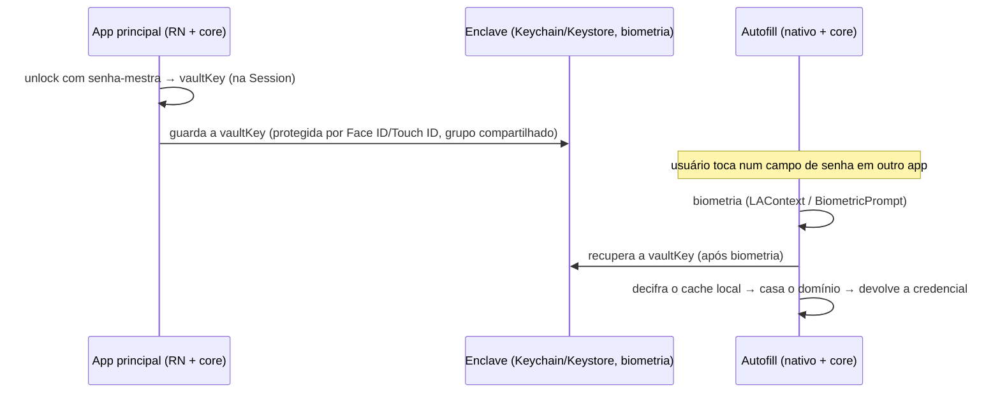

# PRD — EVEPass · Fase 3: Mobile + autofill (Android/iOS)

> **Status (2026-07-06): 🟡 parcial.** ✅ Fundação mobile do core pronta e verificada: `match_credentials` (eTLD+1), `extract_credential`, `session_from_vault_key`, `Session.export_vault_key` (7 testes); o core **compila para iOS** (`EvepassCore.xcframework`, device+sim) e **Android** (`libevepass_core.so`, arm64+x86_64) via UniFFI, com bindings Swift/Kotlin expondo a API (`scripts/build-ios.sh` / `build-android.sh`). O **app RN e as extensões nativas** (Swift/Kotlin em `apps/mobile/native/`) são **scaffold** dos pontos de integração — build/run completo exige projeto RN bare (Xcode/Gradle) + device. Ver `apps/mobile/README.md` e [`STATUS.md`](./STATUS.md).

> Quarto PRD da série e o mais trabalhoso. App React Native sobre o mesmo core Rust, com as extensões **nativas** de autofill. Consumir com Claude Code.

## 1. Objetivo

Levar o EVEPass ao celular: um app React Native (unlock por biometria, cofre, cópia, CRUD, sync) consumindo o **mesmo core Rust** via UniFFI, e — a parte crítica — **autofill nativo** em qualquer app/navegador via as APIs de SO (iOS AutoFill Credential Provider, Android Autofill/Credential Manager). Ao fim da fase, você preenche credenciais em qualquer lugar do telefone.

## 2. Pré-requisitos

`evepass-core` (Fases 0–2) com o modelo de envelope, cache local e as funções de cripto/saúde. O core precisa compilar para **iOS** (xcframework) e **Android** (.so/AAR).

## 3. Escopo

**Dentro:** app RN (unlock biométrico + fallback senha; cofre; busca; cópia; CRUD; TOTP ao vivo; sync via Realtime; cache local cifrado); extensão de autofill iOS (Credential Provider + sugestões QuickType); serviço de autofill Android (AutofillService); matching de domínio/app; guia in-app para ativar o autofill no SO.

**Fora (Fases 4–5):** sharing/collections (Fase 4); passkeys e Android Credential Manager moderno para passkeys, extensão de navegador desktop, pós-quântico (Fase 5). Nesta fase, autofill cobre **senhas**.

## 4. Arquitetura mobile

Mesma separação das outras plataformas, com bridge diferente: **cripto + cache + `Session` no core Rust** (exposto via **UniFFI** → Swift/Kotlin → JS por `uniffi-bindgen-react-native`); **rede + Realtime no JS** com `@supabase/supabase-js`. A `vaultKey` e qualquer chave **nunca chegam à camada JS do RN** — vivem no core (Rust) e, para o caminho biométrico, no **enclave seguro** (iOS Keychain / Android Keystore), manipulado só pelo módulo nativo.

Cada plataforma tem **dois processos** que compartilham o cofre:
- **App principal** (RN + core): destrava, sincroniza e mantém o cache local.
- **Extensão/serviço de autofill** (nativo + core): roda sozinho quando o usuário toca num campo de senha; **lê** o cache local (offline) e devolve a credencial.



**Compartilhamento do cofre:** iOS usa um **App Group** (container compartilhado para o arquivo de cache) + **Keychain access group** para a chave; Android — o `AutofillService` é componente do mesmo app, então acessa o storage interno direto, com a chave protegida pelo Keystore.

## 5. Adições ao core (via UniFFI)

Reusa todos os comandos das fases anteriores; acrescenta:

```rust
struct ItemMatch { id: String, title: String, username: String }
fn match_credentials(query: String) -> Vec<ItemMatch>;   // query = domínio (iOS) ou package/domínio (Android)

struct Credential { username: String, password: String }
fn credential_for(id: String) -> Result<Credential>;     // a extensão decifra o item escolhido

// Caminho biométrico — operam SÓ no lado nativo (nunca no JS do RN)
fn session_from_vault_key(vault_key: Vec<u8>) -> Session; // chave vem do Keychain/Keystore
fn export_vault_key(session: &Session) -> Vec<u8>;        // uma vez, p/ o módulo nativo guardar no enclave
```

`export_vault_key`/`session_from_vault_key` são sensíveis: o módulo nativo (Swift/Kotlin) chama, guarda/recupera no enclave e cria a `Session`. A `vaultKey` não transita pela camada JS.

## 6. Unlock por biometria (app principal)

1. Primeiro login: senha-mestra → deriva → `Session` (fluxo da Fase 1).
2. Oferecer "ativar desbloqueio por biometria": o módulo nativo chama `export_vault_key` e guarda a `vaultKey` no **enclave** com controle de acesso biométrico (`kSecAccessControlBiometryCurrentSet` no iOS; `setUserAuthenticationRequired(true)` no Keystore Android), num **grupo compartilhado com a extensão**.
3. Aberturas seguintes: biometria → recupera a `vaultKey` → `session_from_vault_key` → `Session`.
4. Política de re-autenticação: exigir a senha-mestra periodicamente (ex.: a cada N dias) e quando a biometria mudar (a chave é invalidada por `BiometryCurrentSet` / key invalidation).

## 7. iOS — AutoFill Credential Provider Extension (Swift)

- **Target de extensão** (`ASCredentialProviderViewController`) no mesmo app; core linkado como **xcframework**.
- **Compartilhamento:** App Group para o arquivo de cache; Keychain access group para a `vaultKey`.
- **Sugestões QuickType:** popular o `ASCredentialIdentityStore` com `ASPasswordCredentialIdentity` (a partir dos itens) para o iOS mostrar sugestões acima do teclado; re-sincronizar o store quando o cofre muda.
- **Fluxo de provisão:** ao ser invocada, `LAContext` faz biometria → recupera a `vaultKey` do Keychain → `session_from_vault_key` → `match_credentials(domínio)` → usuário escolhe → `credential_for(id)` → devolve `ASPasswordCredential(user, password)` via o `extensionContext`.
- **Offline:** a extensão usa só o cache local (sem rede).

## 8. Android — Autofill (Kotlin)

- **`AutofillService`** (android.service.autofill) declarado no manifest; core linkado como AAR/.so.
- **Chave:** `vaultKey` no Android Keystore, ligada à biometria (`BiometricPrompt` via androidx.biometric); o serviço acessa o storage interno do app direto.
- **Fluxo:** `onFillRequest` → identificar campos (username/password) e o package/domínio → biometria → recuperar `vaultKey` → `match_credentials(package/domínio)` → montar `Dataset`s → `FillResponse`. Em `onSaveRequest`, oferecer salvar novas credenciais (chama `save_item` do core).
- **Caminho moderno (nota):** o `CredentialProviderService` do Jetpack Credential Manager unifica senhas e passkeys — alvo natural para a Fase 5 (passkeys). Nesta fase, o `AutofillService` clássico cobre senhas.

## 9. Matching de domínio/app (no core)

`match_credentials(query)` compara o domínio (iOS/Android web) ou o package Android contra as URLs dos itens: casamento por **eTLD+1** (não por string exata), com suporte a múltiplas URLs por item. Isso mantém a lógica consistente entre as plataformas. (Associação package↔domínio via Digital Asset Links pode entrar como refinamento.)

## 10. Sync no mobile

Igual à Fase 1: o JS (RN) faz `supabase-js` + assinatura Realtime e chama o core (`apply_remote_changes`) para decifrar/reconciliar/atualizar o cache. Regras de LWW + cópia de conflito idênticas. A **extensão de autofill não sincroniza** — usa o último cache do app principal.

## 11. UI mobile (adaptada do mockup)

A janela de três painéis do desktop não cabe no celular; o mobile é **lista-primeiro**:
- **Unlock:** biometria como ação primária, senha-mestra como fallback.
- **Cofre:** lista com busca no topo; filtro (pastas/tags/smart views) via drawer/aba; cada linha com cópia rápida.
- **Detalhe do item:** campos + cópia por campo + TOTP ao vivo (código + contador).
- **Criar/editar item:** formulário mobile + gerador de senhas.
- **Configurações:** toggle de biometria, auto-lock, e **guia para ativar o autofill** no SO (com deep link: iOS Ajustes › Senhas › AutoFill; Android Ajustes › Serviço de preenchimento automático).

Estética consistente com o desktop (Linear/Raycast): limpa, tema claro/escuro, densidade confortável.

## 12. Segurança da fase

- A `vaultKey` vive na `Session` (Rust) e, para biometria, no **enclave seguro**; nunca na camada JS do RN.
- A extensão de autofill é **read-only** sobre o cache e exige biometria a cada uso.
- Re-autenticação periódica por senha-mestra; a chave biométrica é invalidada se a biometria do aparelho mudar.
- Auto-lock e (herdado da Fase 2) limpeza de clipboard também no mobile.

## 13. Critérios de aceite

- [ ] O core compila e é consumido no RN via UniFFI em iOS e Android.
- [ ] Login por senha-mestra e, depois de ativado, unlock por biometria funcionam; a `vaultKey` nunca aparece na camada JS.
- [ ] CRUD, busca, cópia, TOTP ao vivo e sync (Realtime + conflito) funcionam no app.
- [ ] **iOS:** ao tocar num campo de senha no Safari e em um app de terceiro, a extensão pede biometria, sugere a credencial certa (QuickType) e preenche.
- [ ] **Android:** o `AutofillService` preenche credenciais num app e no Chrome, com biometria, e oferece salvar novas credenciais.
- [ ] Autofill funciona **offline** (só cache local).
- [ ] O matching casa por eTLD+1 e respeita múltiplas URLs por item.
- [ ] Trocar a biometria do aparelho invalida a chave e força re-login por senha-mestra.

## 14. Bibliotecas e tooling

- **RN:** projeto **bare** (ou Expo com prebuild/config plugins) — extensões de autofill exigem targets/serviços nativos. `@supabase/supabase-js`.
- **Bridge do core:** `uniffi-bindgen-react-native` para expor o core Rust ao RN com tipos.
- **iOS (Swift):** AuthenticationServices (`ASCredentialProviderViewController`, `ASCredentialIdentityStore`), LocalAuthentication, Security (Keychain), App Groups. Core como **xcframework** (cargo + uniffi).
- **Android (Kotlin):** `android.service.autofill`, androidx.biometric, Android Keystore. Core como **AAR/.so** (cargo-ndk + uniffi).

## 15. Checklist de execução (ordem sugerida)

1. Pipeline de build do core para mobile: xcframework (iOS) e AAR/.so (Android) via UniFFI; validar `session_from_vault_key`/`match_credentials` num teste nativo.
2. Scaffold RN (bare) + bridge `uniffi-bindgen-react-native`; portar as chamadas ao core.
3. App: unlock (senha) + telas do cofre (lista/detalhe/edição) + busca + cópia + TOTP + sync.
4. Biometria: módulo nativo que exporta/guarda/recupera a `vaultKey` no enclave (grupo compartilhado) + `session_from_vault_key`.
5. **iOS:** target da extensão + App Group + Keychain access group + fluxo de provisão + QuickType (`ASCredentialIdentityStore`).
6. **Android:** `AutofillService` + Keystore biométrico + montagem de `Dataset`/`FillResponse` + `onSaveRequest`.
7. Matching de domínio/app no core (eTLD+1, múltiplas URLs).
8. Guia in-app para ativar o autofill (deep links) + tela de configurações.
9. Passar por todos os critérios de aceite, com foco no autofill em Safari/Chrome e apps de terceiros, offline, e na garantia de que a `vaultKey` não vaza para o JS.
```
