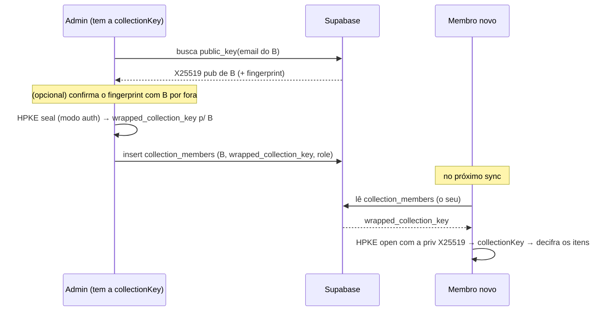

# PRD — EVEPass · Fase 4: Time (compartilhamento) + recuperação

> **Status (2026-07-06): ✅ implementado no desktop.** Core de sharing E2E via **HPKE (RFC 9180)** com assinatura Ed25519 do compartilhador — `create_collection`, `wrap_collection_key_for`, `load_collection_keys`, `encrypt/decrypt_collection_item`, `rotate_collection_key`, `public_key_fingerprint`, `reset_password` (recuperação) — **50 testes no core** (incl. share E2E entre 2 usuários, rejeição de assinatura forjada, rotação). Migration `0002` (public_keys + funções + RLS de collections/membros/itens). Desktop compila: chaves carregadas na Session, cache com `collection_id`, comandos, e UI (sidebar Collections, ShareModal com fingerprint, seletor no form, indicador 👥, fluxo de recuperação). 🟡 Pendente a validação runtime entre 2 contas reais (papéis/RLS, rotação, isolamento do cofre pessoal). Progresso em [`STATUS.md`](./STATUS.md).

> Quinto PRD da série. Liga a parte "do time": collections compartilhadas via HPKE, mais o fluxo de recuperação/kit de emergência polido. Consumir com Claude Code.

## 1. Objetivo

Permitir que você compartilhe credenciais com o time por **collections** cifradas de ponta a ponta — o servidor intermedia o compartilhamento **sem nunca ver a chave** — e entregar um **kit de emergência** confiável, que é a única forma de recuperar acesso num modelo zero-knowledge.

## 2. Pré-requisitos

`evepass-core` com o par de chaves X25519/Ed25519 por usuário (gerado no signup, Fase 0) e HPKE disponível. As tabelas `collections` e `collection_members` já existem (Fase 0).

## 3. Escopo

**Dentro:** criar/gerir collections; compartilhar via HPKE com membros (que já têm conta); papéis (admin/writer/reader); verificação de fingerprint; indicadores de item compartilhado na UI; kit de emergência (gerar) + fluxo de recuperação por Recovery Code; breach proativo cobrindo itens compartilhados.

**Fora (Fase 5):** passkeys, autofill de desktop, extensão de navegador, pós-quântico, Secret Key. *Stretch/opt-in:* convite por link para quem ainda não tem conta; escrow de chave por admin (recuperação assistida que quebra o ZK do membro — só opt-in explícito, desligado por padrão).

## 4. Modelo de compartilhamento (collections + HPKE)

- Uma **collection** tem uma `collectionKey` simétrica aleatória (256 bits). O **nome** da collection é cifrado com a `collectionKey` (visível aos membros, opaco ao servidor).
- **Itens compartilhados** (com `collection_id`) são cifrados com a `collectionKey` — não com a `vaultKey` pessoal.
- Cada **membro** tem a `collectionKey` **embrulhada para a sua chave pública** X25519 (HPKE), guardada em `collection_members.wrapped_collection_key`.



HPKE em **modo auth** (ou uma assinatura Ed25519 sobre o embrulho) garante que o membro sabe **quem** compartilhou — defesa contra o servidor injetar uma chave forjada.

## 5. Refinamentos de esquema e RLS

### Chaves públicas legíveis (para embrulhar)
Separar as chaves **públicas** (legíveis por qualquer autenticado) do `profiles` (que fica só do dono):

```sql
create table public_keys (
  user_id uuid primary key references auth.users(id) on delete cascade,
  email text unique not null,
  public_key bytea not null,          -- X25519
  signing_public_key bytea not null,  -- Ed25519
  created_at timestamptz default now()
);
alter table public_keys enable row level security;
create policy public_keys_read on public_keys for select using (auth.role() = 'authenticated');
create policy public_keys_self on public_keys for insert with check (auth.uid() = user_id);
```
(Popular no signup, junto do `profiles`.)

### Funções auxiliares + políticas de collection

```sql
create or replace function is_member(cid uuid) returns boolean
  language sql security definer stable as $$
  select exists(select 1 from collection_members
                where collection_id = cid and user_id = auth.uid()); $$;

create or replace function can_write(cid uuid) returns boolean
  language sql security definer stable as $$
  select exists(select 1 from collection_members
                where collection_id = cid and user_id = auth.uid()
                and role in ('admin','writer')); $$;

create or replace function is_admin(cid uuid) returns boolean
  language sql security definer stable as $$
  select exists(select 1 from collection_members
                where collection_id = cid and user_id = auth.uid()
                and role = 'admin'); $$;

-- Itens compartilhados
create policy items_collection_read on items for select
  using (collection_id is not null and is_member(collection_id));
create policy items_collection_write on items for all
  using (collection_id is not null and can_write(collection_id))
  with check (collection_id is not null and can_write(collection_id));

-- Collections
create policy collections_read on collections for select
  using (owner_id = auth.uid() or is_member(id));
create policy collections_owner on collections for all
  using (owner_id = auth.uid()) with check (owner_id = auth.uid());

-- Membros (cada um vê o próprio; admin gere)
create policy members_read on collection_members for select
  using (user_id = auth.uid() or is_admin(collection_id));
create policy members_admin on collection_members for all
  using (is_admin(collection_id)) with check (is_admin(collection_id));
```
Papéis: `admin` (gere membros + escreve), `writer` (escreve), `reader` (só lê). As políticas exatas exigem teste.

## 6. Adições ao core (cripto)

```rust
struct NewCollection { collection_id: String, name_ciphertext: Vec<u8> }
fn create_collection(session: &Session, name: String) -> Result<NewCollection>; // gera collectionKey, guarda na Session, cifra o nome com ela

struct MemberRow { collection_id: String, wrapped_collection_key: Vec<u8>, sender_signing_pub: Vec<u8> }
fn load_collection_keys(session: &Session, members: Vec<MemberRow>) -> Result<()>; // HPKE open de cada → popula a Session

fn wrap_collection_key_for(session: &Session, collection_id: String,
                           recipient_pub: Vec<u8>) -> Result<Vec<u8>>; // HPKE seal (modo auth)

fn encrypt_collection_item(session: &Session, collection_id: String, item_json: String) -> Result<Blob>;
fn decrypt_collection_item(session: &Session, collection_id: String, blob: Blob) -> Result<String>;
fn decrypt_collection_name(session: &Session, collection_id: String, name_ct: Vec<u8>) -> Result<String>;

fn public_key_fingerprint(pub_key: Vec<u8>) -> String; // p/ verificação out-of-band (hex agrupado ou palavras)
```

A `Session` passa a manter um mapa `collection_id → collectionKey`, preenchido por `load_collection_keys` logo após o unlock.

## 7. Carregamento de chaves no unlock

Após o `complete_login` (Fase 1) desembrulhar a `vaultKey` e as privadas do usuário, o cliente:
1. busca as linhas de `collection_members` do usuário;
2. chama `load_collection_keys(members)` → o core faz HPKE open de cada `wrapped_collection_key` com a priv X25519 → popula o mapa da `Session`.

A partir daí, `decrypt_collection_item`/`encrypt_collection_item` funcionam para as collections a que o usuário pertence.

## 8. Convites, papéis e verificação

- Compartilhar exige que o destinatário **já tenha conta** (para ter chave pública publicada). Fluxo: admin busca `public_key` por email → (opcional) confirma o **fingerprint** com o colega por fora → `wrap_collection_key_for` → grava `collection_members` (com papel).
- **Verificação de fingerprint:** a UI mostra o fingerprint da chave pública do destinatário; o admin confirma antes de compartilhar. Protege contra o servidor substituir a chave (MITM).
- **Revogar acesso:** remover a linha de `collection_members`. *Nota de segurança:* quem já teve a `collectionKey` pode tê-la copiado; para dados críticos, após remover um membro, **rotacionar** a `collectionKey` (gerar nova, re-cifrar os itens da collection, re-embrulhar para os membros restantes). Oferecer "rotacionar chave" como ação de admin.

## 9. Recuperação / kit de emergência (polido)

- **Gerar kit de emergência:** documento imprimível/PDF com email, o **Recovery Code** e instruções (estilo 1Password). Gerado no cliente.
- **Fluxo de recuperação:** "Esqueci a senha" → email → busca `login_params` + `wrapped_vault_key_recovery` → digita o Recovery Code → `unlock_with_recovery` → define nova senha (`change_password`: re-embrulha a `vaultKey`, atualiza o auth no Supabase e gera **novo** `wrapped_vault_key_recovery` + novo Recovery Code) → mostra o novo kit.
- **Acesso a collections preservado:** como o par de chaves X25519/Ed25519 é embrulhado pela `vaultKey` (que foi recuperada), a recuperação **mantém** o acesso às collections.
- **Time:** se um membro perder tudo (senha **e** Recovery Code), o cofre pessoal dele é perdido (tradeoff do ZK); um admin apenas **re-convida** a nova conta dele às collections. Escrow por admin (recuperação assistida que quebra o ZK do membro) fica como **opt-in** explícito e desligado por padrão.

## 10. Breach proativo (refinamento da Fase 2)

- Re-checar periodicamente (ex.: na abertura do app, com throttle) e **incluir itens de collection** na varredura de saúde/breach.
- Notificação/badge quando surgir uma senha vazada nova. Mantém a k-anonymity da Fase 2 (só prefixos ao HIBP).

## 11. UI

- **Gestão de collections:** criar/renomear/excluir; lista de membros com papel; adicionar membro (com verificação de fingerprint); "rotacionar chave"; sair da collection.
- **Sidebar/lista:** seção de collections compartilhadas separada das pastas pessoais; indicador visual de "compartilhado" no item (ícone de pessoas do mockup).
- **Mover/criar item numa collection:** escolher a collection no form (define `collection_id` → cifra com a `collectionKey`).
- **Kit de emergência:** tela para gerar/reexportar o PDF, e o fluxo de recuperação.

## 12. Segurança da fase

- Compartilhamento é E2E: a `collectionKey` só existe em claro no cliente; o servidor guarda embrulhos HPKE.
- Modo auth do HPKE (ou assinatura Ed25519) autentica **quem** compartilhou; a verificação de fingerprint fecha o vetor de servidor malicioso.
- Um admin **não** consegue ler o cofre **pessoal** de um membro (só o que está nas collections). Escrow é opt-in e explícito.
- Rotação de chave após revogação para dados críticos.
- Recuperação preserva as chaves assimétricas → mantém acesso às collections.

## 13. Critérios de aceite

- [ ] Criar collection, compartilhar com um segundo usuário (conta real), e o segundo passa a decifrar os itens após o sync.
- [ ] Papéis valem: um `reader` não consegue escrever (bloqueado pela RLS **e** pela UI); `writer`/`admin` conseguem.
- [ ] Fingerprint do destinatário é exibido e confere com o do outro dispositivo antes de compartilhar.
- [ ] Nome da collection e itens compartilhados são opacos no Postgres (inspeção não revela plaintext).
- [ ] Revogar + "rotacionar chave" re-cifra os itens e re-embrulha para os membros restantes; o removido não decifra o conteúdo novo.
- [ ] Recuperação por Recovery Code redefine a senha, **mantém** o acesso às collections e gera um novo kit de emergência.
- [ ] Um admin não consegue ler itens **pessoais** de um membro.
- [ ] Breach cobre também itens de collection e notifica quando surge algo novo.

## 14. Bibliotecas

- **Rust (core):** `hpke` (ou `hpke-rs`) — agora efetivamente usado; `ed25519-dalek` (assinatura/verificação do sharer). Geração do kit em PDF: lib de PDF no app (desktop: JS/Rust; mobile: lib RN) ou "imprimir para PDF".
- **JS/RN:** `@supabase/supabase-js` (leitura de `public_keys`, `collection_members`, itens compartilhados).

## 15. Checklist de execução (ordem sugerida)

1. Tabela `public_keys` + popular no signup; funções `is_member`/`can_write`/`is_admin` + políticas RLS de collections/membros/itens compartilhados.
2. Core: `create_collection`, `wrap_collection_key_for`, `load_collection_keys`, `encrypt/decrypt_collection_item`, `decrypt_collection_name`, `public_key_fingerprint`.
3. Carregamento das chaves de collection no unlock.
4. UI de gestão de collections + adicionar membro com verificação de fingerprint + papéis.
5. Mover/criar itens em collection; indicadores de compartilhado na sidebar/lista.
6. Revogação + rotação de chave.
7. Kit de emergência (gerar PDF) + fluxo de recuperação por Recovery Code (mantendo acesso às collections).
8. Breach proativo cobrindo itens de collection + notificação.
9. Passar por todos os critérios de aceite, com foco no teste de papéis, rotação de chave e no isolamento do cofre pessoal.
```
