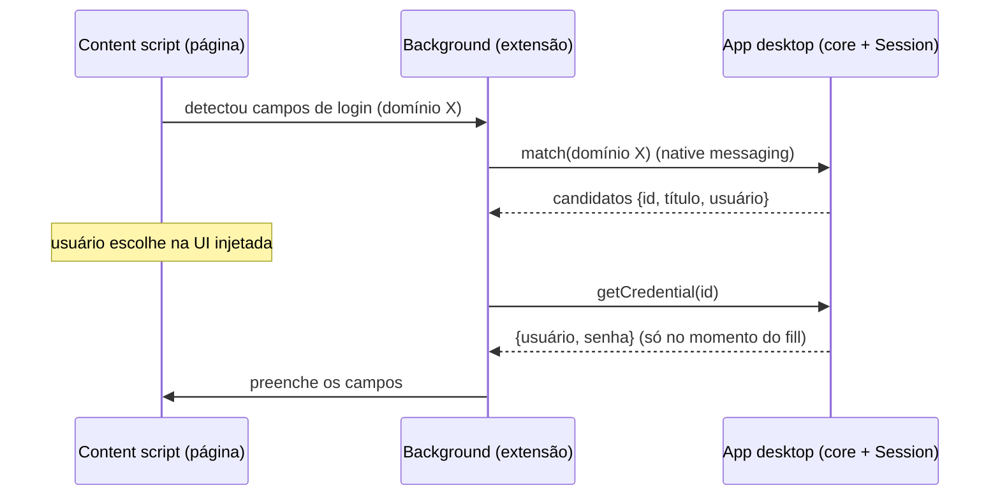

# PRD — EVEPass · Fase 5: Opcionais (à la carte)

> **Status (2026-07-06): 🟡 parcial.** Os módulos habilitados pela camada de cripto-agilidade e o core de passkeys estão **implementados e testados no core** (57 testes no total): **5B pós-quântico híbrido** (`core/src/pq.rs` — X25519+ML-KEM-768 combinados via HKDF sob nova versão de envelope; ambos os KEMs contribuem), **5C Secret Key/2SKD** (`keys::derive_enc_auth_with_secret` — HKDF salt=SecretKey; breach sem a Secret Key não desembrulha), **5D passkeys** (`core/src/passkey.rs` — P-256 ES256 create/sign/verify como item cifrado). **5A extensão de navegador** (`apps/browser-extension/`, MV3 + protocolo de native messaging) é scaffold — falta o host no app + pareamento. Integração viva no fluxo de conta/UI e validação runtime pendentes. Progresso em [`STATUS.md`](./STATUS.md).

> Sexto e último PRD da série. Quatro upgrades **independentes** que elevam o EVEPass acima dos concorrentes. Pegue na ordem que fizer sentido. Consumir com Claude Code.

## 1. Objetivo e natureza

Diferente das Fases 0–4, aqui não há um encadeamento obrigatório: cada módulo é autônomo. Todos se apoiam nas invariantes já estabelecidas (chaves só no core Rust / enclave; camada de cripto-agilidade versionada) — o que torna dois deles (pós-quântico e Secret Key) essencialmente configuráveis em vez de reescritas.

## 2. Pré-requisitos

EVEPass funcional nas Fases 0–4. Para o pós-quântico e o Secret Key, a **camada de cripto-agilidade** (envelope versionado) da Fase 0 é o que permite adotá-los sem quebrar o que já existe.

## 3. Priorização sugerida (pro seu caso: pessoal/time)

1. **5A — Extensão de navegador** (maior valor diário; é o "autofill de desktop" na prática).
2. **5D — Passkeys** (cada vez mais usado; mais complexo).
3. **5C — Secret Key** (ganho real de segurança, mas com fricção de onboarding + migração).
4. **5B — Pós-quântico** (future-proofing; baixa urgência nessa escala, alto fator "uau").

---

## Módulo 5A — Autofill de desktop + extensão de navegador

### Objetivo
Preencher e salvar credenciais direto no navegador (Chrome/Firefox/Edge), com o cofre e as chaves permanecendo no app desktop (core Rust).

### Abordagem
A extensão **não** tem cofre próprio: ela conversa com o app desktop por **native messaging** (IPC local, não rede). O app detém a `Session` e responde a pedidos de match/fill/save.



### Pontos-chave
- **Manifest V3:** content script (detectar campos + injetar UI de fill), service worker (porta de native messaging), popup (busca no cofre + estado travado).
- **Host de native messaging:** o app desktop registra o manifesto; a extensão conecta. Mensagens: `status`, `match(domain)`, `getCredential(id)`, `saveCredential(...)`.
- **Segurança:** exige `Session` destravada; **pareamento** com aprovação do usuário na primeira conexão; a credencial só cruza para a extensão **no momento do fill**; as chaves nunca saem do app. Reusar `match_credentials` (Fase 3) por eTLD+1.
- **Salvar:** ao submeter um formulário com credencial nova, oferecer salvar (o app cifra via core e sincroniza).
- **Fora do navegador:** autofill de apps nativos no desktop **não** tem API padrão como no mobile; o caminho realista é via APIs de acessibilidade (frágil) — deixar como extra opcional. O **command palette** (Fase 2) já é o "preencher/copiar" primário fora do navegador.

---

## Módulo 5B — Pós-quântico híbrido

### Objetivo
Proteger a camada de chave pública contra *harvest-now-decrypt-later*, adotando o híbrido **X25519 + ML-KEM-768**.

### Abordagem
Só a **camada assimétrica** muda (embrulho de `collectionKey` e, se quiser, das chaves pessoais). A camada simétrica em repouso (XChaCha20 de 256 bits) já é resistente a quântico o suficiente e **não** muda.

### Pontos-chave
- **KEM híbrido:** `shared_secret = HKDF(ss_x25519 || ss_mlkem)`, usado para embrulhar a `collectionKey` com AEAD. Nova **versão de envelope**; re-embrulho *lazy* dos itens/chaves.
- **Assinaturas (opcional):** ML-DSA-65 junto do/no lugar do Ed25519 para autenticar o sharer.
- **Crates:** `ml-kem` (RustCrypto) ou `libcrux-ml-kem`, plugados atrás da interface de agilidade.
- **Nota de padrão:** o HPKE pós-quântico ainda está em rascunho; um KEM híbrido próprio alimentando HKDF+AEAD é o caminho pragmático — mantenha versionado para migrar ao PQ-HPKE padronizado depois.

---

## Módulo 5C — Secret Key (estilo 1Password)

### Objetivo
Blindar o cenário "vazamento do servidor **+** senha-mestra fraca": mesmo com os dois, falta ao atacante a Secret Key.

### Abordagem
Derivação de dois segredos (2SKD): `encKey = HKDF(masterKey, salt = SecretKey, info)`. A **Secret Key** (128 bits) é gerada no cliente, guardada no dispositivo e no **kit de emergência** — nunca no servidor.

### Pontos-chave
- **Onboarding:** gerar e exibir a Secret Key; incluí-la no kit de emergência (junto do Recovery Code).
- **Novo dispositivo:** exige digitar/escanear a Secret Key (QR do kit ou transferência de outro dispositivo). É a **fricção de UX** que justifica ela ser opcional.
- **Migração:** ligar numa conta existente = re-derivar + re-embrulhar a `vaultKey` (via a versão de params). Não re-cifra os itens.
- **Ganho:** breach do Supabase deixa de ser suficiente para brute-force offline, mesmo com senha fraca.

---

## Módulo 5D — Passkeys

### Objetivo
Gerenciar e usar **passkeys** (WebAuthn/FIDO2) pelo EVEPass — armazenar, criar e assinar asserções — em vez de depender só de senhas.

### Abordagem
Uma passkey é um par de chaves + metadados (`rpId`, `userHandle`, contador), guardada como um **tipo de item** cifrado como qualquer outro. Usá-la = assinar o desafio WebAuthn com a privada guardada.

### Pontos-chave
- **Integração como provider:** reusar as extensões da Fase 3 — iOS (APIs de passkey do `ASCredentialProvider`) e Android (`CredentialProviderService` do Credential Manager). No desktop, a **extensão de navegador (5A)** atua como autenticador WebAuthn (intercepta `navigator.credentials.create/get`).
- **Criar:** gerar keypair, guardar a privada no cofre, devolver a pública + attestation ao RP.
- **Usar:** assinar o challenge com a privada guardada; devolver a asserção.
- **Stretch avançado — unlock por passkey (PRF):** a extensão **PRF** do WebAuthn pode derivar um segredo estável para desembrulhar o cofre (unlock sem senha-mestra). Marcar como avançado.
- **Libs:** APIs de plataforma no mobile fazem o grosso; no core/desktop, crates de WebAuthn/FIDO2 (ex.: `passkey-rs`).

---

## 4. Segurança (transversal)

- **5A:** credencial cruza para a extensão só no fill, por IPC local; pareamento com aprovação; chaves ficam no app.
- **5B:** só a camada assimétrica muda; versionada para evoluir.
- **5C:** a Secret Key nunca vai ao servidor; entra no kit de emergência para recuperação.
- **5D:** privadas de passkey são itens cifrados; asserções assinadas localmente.

## 5. Critérios de aceite (por módulo)

- [ ] **5A:** a extensão preenche login em sites reais e salva credenciais novas; o cofre/keys permanecem no app; a credencial só trafega no fill; funciona após pareamento.
- [ ] **5B:** embrulhos de `collectionKey` usam o híbrido X25519+ML-KEM-768 sob nova versão de envelope; os antigos migram *lazy*; a camada em repouso não muda.
- [ ] **5C:** com a Secret Key ligada, um novo dispositivo exige a chave; a migração re-embrulha sem re-cifrar itens; o kit de emergência inclui a Secret Key.
- [ ] **5D:** criar e usar uma passkey num RP real (via extensão no desktop e provider no mobile); a privada fica cifrada no cofre.

## 6. Bibliotecas

- **5A:** WebExtension (MV3); host de native messaging no app desktop (Tauri).
- **5B:** `ml-kem` / `libcrux-ml-kem`; (opcional) `ml-dsa`.
- **5C:** só `hkdf`/`argon2` já existentes + mudança de versão de params.
- **5D:** APIs de plataforma (iOS/Android) + `passkey-rs` (ou equivalente) no core/desktop.

## 7. Checklist de execução (por módulo, na prioridade sugerida)

1. **5A:** scaffold da extensão MV3 → host de native messaging no app → protocolo `status/match/getCredential/saveCredential` → detecção/injeção de fill → pareamento/aprovação → salvar credencial.
2. **5D:** tipo de item passkey → criar/assinar no core → provider iOS/Android (reuso da Fase 3) → autenticador WebAuthn na extensão desktop → (stretch) unlock por PRF.
3. **5C:** versão de params com 2SKD → onboarding + kit de emergência com Secret Key → fluxo de novo dispositivo → migração de conta existente.
4. **5B:** KEM híbrido X25519+ML-KEM-768 atrás da agilidade → nova versão de envelope → re-embrulho lazy → (opcional) ML-DSA nas assinaturas de sharing.
```
